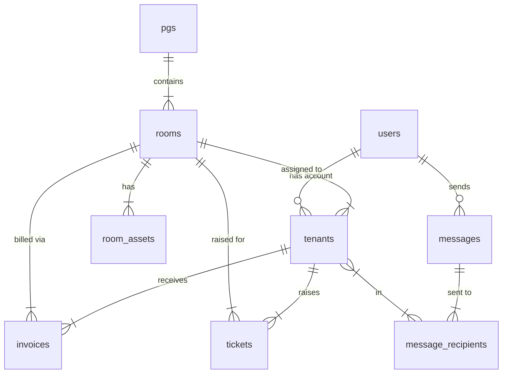

# PostgreSQL Database Schema — PG Management App

Derived from the UI codebase at `c:\Users\User\Desktop\pg\PG-APP\UI`.  
This covers every data entity used in the application.

---

## Entity Overview

| # | Table | Description |
|---|-------|-------------|
| 1 | `users` | Admin and tenant login accounts |
| 2 | `pgs` | PG properties (buildings) |
| 3 | `rooms` | Individual rooms inside each PG |
| 4 | `room_assets` | Furniture/equipment inside each room |
| 5 | `tenants` | Tenant profile and occupancy details |
| 6 | `messages` | Announcements / notifications sent by admin |
| 7 | `message_recipients` | Junction table — which tenants got each message |
| 8 | `menu_items` | Weekly mess/food menu |
| 9 | `holidays` | Public / PG holiday calendar |
| 10 | `invoices` | Monthly rent + utility bills per tenant |
| 11 | `tickets` | Maintenance / complaint tickets |

---

## 1. ENUM Types

```sql
-- Run this block FIRST before any table creation

CREATE TYPE user_role AS ENUM ('admin', 'tenant');
CREATE TYPE room_type AS ENUM ('AC', 'Non-AC');
CREATE TYPE room_status AS ENUM ('available', 'occupied', 'maintenance');
CREATE TYPE asset_condition AS ENUM ('good', 'fair', 'needs-repair');
CREATE TYPE stay_type AS ENUM ('monthly', 'daily');
CREATE TYPE tenant_status AS ENUM ('active', 'inactive');
CREATE TYPE message_type AS ENUM ('rent-reminder', 'holiday-notice', 'announcement');
CREATE TYPE invoice_status AS ENUM ('paid', 'pending', 'overdue');
CREATE TYPE ticket_category AS ENUM ('plumbing', 'electrical', 'wifi', 'furniture', 'cleaning', 'other');
CREATE TYPE ticket_status AS ENUM ('open', 'in-progress', 'resolved', 'closed');
CREATE TYPE ticket_priority AS ENUM ('low', 'medium', 'high');
```

---

## 2. Table Definitions (DDL)

### Table 1 — `users`
```sql
CREATE TABLE users (
    id          SERIAL PRIMARY KEY,
    uid         VARCHAR(50)  UNIQUE NOT NULL,          -- e.g. "admin-1", "tenant-1"
    name        VARCHAR(150) NOT NULL,
    email       VARCHAR(255) UNIQUE NOT NULL,
    password_hash TEXT        NOT NULL,
    role        user_role    NOT NULL DEFAULT 'tenant',
    avatar_url  TEXT,
    created_at  TIMESTAMPTZ  NOT NULL DEFAULT NOW(),
    updated_at  TIMESTAMPTZ  NOT NULL DEFAULT NOW()
);
```

---

### Table 2 — `pgs`
```sql
CREATE TABLE pgs (
    id              SERIAL PRIMARY KEY,
    uid             VARCHAR(50)  UNIQUE NOT NULL,      -- e.g. "pg-1"
    name            VARCHAR(200) NOT NULL,
    address         TEXT         NOT NULL,
    total_rooms     INT          NOT NULL DEFAULT 0,
    occupied_rooms  INT          NOT NULL DEFAULT 0,
    total_beds      INT          NOT NULL DEFAULT 0,
    occupied_beds   INT          NOT NULL DEFAULT 0,
    created_at      TIMESTAMPTZ  NOT NULL DEFAULT NOW(),
    updated_at      TIMESTAMPTZ  NOT NULL DEFAULT NOW()
);
```

---

### Table 3 — `rooms`
```sql
CREATE TABLE rooms (
    id          SERIAL PRIMARY KEY,
    uid         VARCHAR(50)  UNIQUE NOT NULL,          -- e.g. "room-1"
    pg_id       INT          NOT NULL REFERENCES pgs(id) ON DELETE CASCADE,
    room_number VARCHAR(20)  NOT NULL,
    floor       INT          NOT NULL DEFAULT 1,
    type        room_type    NOT NULL,
    capacity    INT          NOT NULL DEFAULT 1,
    occupants   INT          NOT NULL DEFAULT 0,
    rent        NUMERIC(10,2) NOT NULL,
    status      room_status  NOT NULL DEFAULT 'available',
    created_at  TIMESTAMPTZ  NOT NULL DEFAULT NOW(),
    updated_at  TIMESTAMPTZ  NOT NULL DEFAULT NOW(),
    UNIQUE (pg_id, room_number)
);
```

---

### Table 4 — `room_assets`
```sql
CREATE TABLE room_assets (
    id          SERIAL PRIMARY KEY,
    uid         VARCHAR(50)  UNIQUE NOT NULL,          -- e.g. "a1"
    room_id     INT          NULL REFERENCES rooms(id) ON DELETE SET NULL,  -- NULL = common-area asset
    name        VARCHAR(200) NOT NULL,
    condition   asset_condition NOT NULL DEFAULT 'good',
    is_common   BOOLEAN      NOT NULL DEFAULT FALSE,
    created_at  TIMESTAMPTZ  NOT NULL DEFAULT NOW(),
    updated_at  TIMESTAMPTZ  NOT NULL DEFAULT NOW()
);
```

---

### Table 5 — `tenants`
```sql
CREATE TABLE tenants (
    id                 SERIAL PRIMARY KEY,
    uid                VARCHAR(50)  UNIQUE NOT NULL,   -- e.g. "tenant-1"
    tenant_code        VARCHAR(30)  UNIQUE NOT NULL,   -- e.g. "TEN-2024-001"
    user_id            INT          NULL REFERENCES users(id) ON DELETE SET NULL,
    room_id            INT          NOT NULL REFERENCES rooms(id),
    name               VARCHAR(150) NOT NULL,
    email              VARCHAR(255) NOT NULL,
    phone              VARCHAR(20)  NOT NULL,
    stay_type          stay_type    NOT NULL DEFAULT 'monthly',
    join_date          DATE         NOT NULL,
    rent_amount        NUMERIC(10,2) NOT NULL,
    security_deposit   NUMERIC(10,2) NOT NULL DEFAULT 0,
    emergency_contact  VARCHAR(20)  NOT NULL,
    id_proof           VARCHAR(100) NOT NULL,
    status             tenant_status NOT NULL DEFAULT 'active',
    created_at         TIMESTAMPTZ  NOT NULL DEFAULT NOW(),
    updated_at         TIMESTAMPTZ  NOT NULL DEFAULT NOW()
);
```

---

### Table 6 — `messages`
```sql
CREATE TABLE messages (
    id          SERIAL PRIMARY KEY,
    uid         VARCHAR(50)  UNIQUE NOT NULL,          -- e.g. "msg-1"
    type        message_type NOT NULL,
    title       VARCHAR(300) NOT NULL,
    content     TEXT         NOT NULL,
    sent_by     INT          NULL REFERENCES users(id) ON DELETE SET NULL,
    sent_to_all BOOLEAN      NOT NULL DEFAULT TRUE,    -- true = sent to all tenants
    sent_at     TIMESTAMPTZ  NOT NULL DEFAULT NOW(),
    created_at  TIMESTAMPTZ  NOT NULL DEFAULT NOW()
);
```

---

### Table 7 — `message_recipients`  *(junction)*
```sql
CREATE TABLE message_recipients (
    id          SERIAL PRIMARY KEY,
    message_id  INT NOT NULL REFERENCES messages(id) ON DELETE CASCADE,
    tenant_id   INT NOT NULL REFERENCES tenants(id) ON DELETE CASCADE,
    UNIQUE (message_id, tenant_id)
);
```

---

### Table 8 — `menu_items`
```sql
CREATE TABLE menu_items (
    id          SERIAL PRIMARY KEY,
    day         VARCHAR(10)  NOT NULL UNIQUE,          -- 'Monday' … 'Sunday'
    breakfast   TEXT         NOT NULL,
    lunch       TEXT         NOT NULL,
    dinner      TEXT         NOT NULL,
    updated_at  TIMESTAMPTZ  NOT NULL DEFAULT NOW()
);
```

---

### Table 9 — `holidays`
```sql
CREATE TABLE holidays (
    id          SERIAL PRIMARY KEY,
    uid         VARCHAR(20)  UNIQUE NOT NULL,          -- e.g. "h-1"
    date        DATE         NOT NULL UNIQUE,
    name        VARCHAR(200) NOT NULL,
    description TEXT,
    created_at  TIMESTAMPTZ  NOT NULL DEFAULT NOW()
);
```

---

### Table 10 — `invoices`
```sql
CREATE TABLE invoices (
    id            SERIAL PRIMARY KEY,
    uid           VARCHAR(50)  UNIQUE NOT NULL,        -- e.g. "inv-1"
    tenant_id     INT          NOT NULL REFERENCES tenants(id) ON DELETE CASCADE,
    room_id       INT          NOT NULL REFERENCES rooms(id),
    month         VARCHAR(30)  NOT NULL,               -- e.g. "February 2026"
    rent_amount   NUMERIC(10,2) NOT NULL,
    electricity   NUMERIC(10,2) NOT NULL DEFAULT 0,
    water         NUMERIC(10,2) NOT NULL DEFAULT 0,
    maintenance   NUMERIC(10,2) NOT NULL DEFAULT 0,
    total         NUMERIC(10,2) NOT NULL,
    status        invoice_status NOT NULL DEFAULT 'pending',
    due_date      DATE         NOT NULL,
    paid_date     DATE,
    created_at    TIMESTAMPTZ  NOT NULL DEFAULT NOW(),
    updated_at    TIMESTAMPTZ  NOT NULL DEFAULT NOW()
);
```

---

### Table 11 — `tickets`
```sql
CREATE TABLE tickets (
    id           SERIAL PRIMARY KEY,
    uid          VARCHAR(50)  UNIQUE NOT NULL,         -- e.g. "tkt-1"
    tenant_id    INT          NOT NULL REFERENCES tenants(id) ON DELETE CASCADE,
    room_id      INT          NOT NULL REFERENCES rooms(id),
    category     ticket_category NOT NULL,
    subject      VARCHAR(300) NOT NULL,
    description  TEXT         NOT NULL,
    status       ticket_status NOT NULL DEFAULT 'open',
    priority     ticket_priority NOT NULL DEFAULT 'medium',
    created_at   TIMESTAMPTZ  NOT NULL DEFAULT NOW(),
    updated_at   TIMESTAMPTZ  NOT NULL DEFAULT NOW(),
    resolved_at  TIMESTAMPTZ
);
```

---

## 3. Mock INSERT Statements

> Run these **in order** to respect foreign-key constraints.

### INSERT — `users`
```sql
INSERT INTO users (uid, name, email, password_hash, role) VALUES
  ('admin-1',  'Rajesh Kumar',  'admin@pgmanager.com', '$2b$10$placeholder_hash_admin',   'admin'),
  ('tenant-1', 'Arjun Sharma',  'arjun@email.com',     '$2b$10$placeholder_hash_arjun',  'tenant'),
  ('tenant-2', 'Priya Patel',   'priya@email.com',     '$2b$10$placeholder_hash_priya',  'tenant'),
  ('tenant-3', 'Vikram Singh',  'vikram@email.com',    '$2b$10$placeholder_hash_vikram', 'tenant'),
  ('tenant-4', 'Neha Gupta',    'neha@email.com',      '$2b$10$placeholder_hash_neha',   'tenant'),
  ('tenant-5', 'Rahul Verma',   'rahul@email.com',     '$2b$10$placeholder_hash_rahul',  'tenant'),
  ('tenant-6', 'Anjali Rao',    'anjali@email.com',    '$2b$10$placeholder_hash_anjali', 'tenant');
```

> **Note:** Replace `placeholder_hash_*` with real bcrypt hashes before going live.

---

### INSERT — `pgs`
```sql
INSERT INTO pgs (uid, name, address, total_rooms, occupied_rooms, total_beds, occupied_beds) VALUES
  ('pg-1', 'Sunshine PG',     '123, MG Road, Bangalore',     20, 16, 40, 32),
  ('pg-2', 'Green Valley PG', '45, Koramangala, Bangalore',  15, 12, 30, 24),
  ('pg-3', 'City Nest PG',    '78, HSR Layout, Bangalore',   10,  8, 20, 15);
```

---

### INSERT — `rooms`
```sql
INSERT INTO rooms (uid, pg_id, room_number, floor, type, capacity, occupants, rent, status) VALUES
  ('room-1', 1, '101',   1, 'AC',     2, 2, 12000, 'occupied'),
  ('room-2', 1, '102',   1, 'AC',     2, 1, 12000, 'occupied'),
  ('room-3', 1, '103',   1, 'Non-AC', 3, 3,  8000, 'occupied'),
  ('room-4', 1, '201',   2, 'AC',     2, 0, 13000, 'available'),
  ('room-5', 1, '202',   2, 'Non-AC', 3, 2,  7500, 'occupied'),
  ('room-6', 2, 'G-101', 1, 'AC',     1, 1, 15000, 'occupied'),
  ('room-7', 2, 'G-102', 1, 'Non-AC', 2, 2,  9000, 'occupied'),
  ('room-8', 3, 'C-101', 1, 'AC',     2, 0, 11000, 'maintenance');
```

---

### INSERT — `room_assets`
```sql
-- Room 101 assets
INSERT INTO room_assets (uid, room_id, name, condition) VALUES
  ('a1',  1, 'Single Bed',   'good'),
  ('a2',  1, 'Study Table',  'good'),
  ('a3',  1, 'Wardrobe',     'fair'),
  ('a4',  1, 'Chair',        'good');

-- Room 102 assets
INSERT INTO room_assets (uid, room_id, name, condition) VALUES
  ('a5',  2, 'Single Bed',   'good'),
  ('a6',  2, 'Study Table',  'needs-repair'),
  ('a7',  2, 'Wardrobe',     'good');

-- Room 103 assets
INSERT INTO room_assets (uid, room_id, name, condition) VALUES
  ('a8',  3, 'Bunk Bed',     'good'),
  ('a9',  3, 'Single Bed',   'fair'),
  ('a10', 3, 'Study Table',  'good');

-- Room 201 assets
INSERT INTO room_assets (uid, room_id, name, condition) VALUES
  ('a11', 4, 'Single Bed',   'good'),
  ('a12', 4, 'Study Table',  'good'),
  ('a13', 4, 'Wardrobe',     'good'),
  ('a14', 4, 'Chair',        'good');

-- Room 202 assets
INSERT INTO room_assets (uid, room_id, name, condition) VALUES
  ('a15', 5, 'Bunk Bed',     'fair'),
  ('a16', 5, 'Single Bed',   'good');

-- Room G-101 assets
INSERT INTO room_assets (uid, room_id, name, condition) VALUES
  ('a17', 6, 'Single Bed',   'good'),
  ('a18', 6, 'Study Table',  'good'),
  ('a19', 6, 'Wardrobe',     'good'),
  ('a20', 6, 'AC Unit',      'good');

-- Room G-102 assets
INSERT INTO room_assets (uid, room_id, name, condition) VALUES
  ('a21', 7, 'Single Bed',   'good'),
  ('a22', 7, 'Single Bed',   'good'),
  ('a23', 7, 'Study Table',  'fair');

-- Room C-101 assets
INSERT INTO room_assets (uid, room_id, name, condition) VALUES
  ('a24', 8, 'Single Bed',   'needs-repair'),
  ('a25', 8, 'Study Table',  'needs-repair');

-- Common area assets (no room, is_common = true)
INSERT INTO room_assets (uid, room_id, name, condition, is_common) VALUES
  ('ca-1', NULL, 'Washing Machine (Common Area)',    'good', TRUE),
  ('ca-2', NULL, 'Refrigerator (Common Kitchen)',    'good', TRUE),
  ('ca-3', NULL, 'Microwave (Common Kitchen)',       'fair', TRUE),
  ('ca-4', NULL, 'Water Purifier (Ground Floor)',    'good', TRUE),
  ('ca-5', NULL, 'TV (Common Room)',                 'good', TRUE),
  ('ca-6', NULL, 'CCTV Camera (Entrance)',           'good', TRUE),
  ('ca-7', NULL, 'CCTV Camera (Corridor 1F)',        'good', TRUE),
  ('ca-8', NULL, 'Generator (Backup)',               'fair', TRUE);
```

---

### INSERT — `tenants`
```sql
INSERT INTO tenants (uid, tenant_code, user_id, room_id, name, email, phone,
                     stay_type, join_date, rent_amount, security_deposit,
                     emergency_contact, id_proof, status) VALUES
  ('tenant-1', 'TEN-2024-001', 2, 1, 'Arjun Sharma',  'arjun@email.com',
   '+91 98765 43210', 'monthly', '2024-06-15', 12000, 24000,
   '+91 98765 43211', 'Aadhaar - XXXX-XXXX-1234', 'active'),

  ('tenant-2', 'TEN-2024-002', 3, 2, 'Priya Patel',   'priya@email.com',
   '+91 87654 32109', 'monthly', '2024-08-01', 12000, 24000,
   '+91 87654 32100', 'Aadhaar - XXXX-XXXX-5678', 'active'),

  ('tenant-3', 'TEN-2024-003', 4, 3, 'Vikram Singh',  'vikram@email.com',
   '+91 76543 21098', 'monthly', '2024-03-10',  8000, 16000,
   '+91 76543 21099', 'PAN - ABCDE1234F',          'active'),

  ('tenant-4', 'TEN-2024-004', 5, 6, 'Neha Gupta',    'neha@email.com',
   '+91 65432 10987', 'daily',   '2025-01-20',   800,  5000,
   '+91 65432 10988', 'Passport - J1234567',       'active'),

  ('tenant-5', 'TEN-2024-005', 6, 5, 'Rahul Verma',   'rahul@email.com',
   '+91 54321 09876', 'monthly', '2024-11-01',  7500, 15000,
   '+91 54321 09877', 'Aadhaar - XXXX-XXXX-9012', 'active'),

  ('tenant-6', 'TEN-2023-010', 7, 7, 'Anjali Rao',    'anjali@email.com',
   '+91 43210 98765', 'monthly', '2023-09-15',  9000, 18000,
   '+91 43210 98766', 'Aadhaar - XXXX-XXXX-3456', 'inactive');
```

---

### INSERT — `messages`
```sql
INSERT INTO messages (uid, type, title, content, sent_by, sent_to_all, sent_at) VALUES
  ('msg-1', 'rent-reminder',  'Rent Due - February 2026',
   'Dear Tenants, this is a reminder that rent for February 2026 is due by the 5th. Please ensure timely payment to avoid late fees. Thank you!',
   1, TRUE, '2026-02-01 09:00:00+05:30'),

  ('msg-2', 'holiday-notice', 'Holi Festival - Office Closed',
   'The management office will be closed on March 14th for Holi celebrations. Emergency contact: +91 98765 43210. Happy Holi!',
   1, TRUE, '2026-03-10 10:00:00+05:30'),

  ('msg-3', 'announcement',   'Water Tank Cleaning',
   'Water tank cleaning is scheduled for this Saturday (Feb 28th) from 10 AM to 2 PM. Please store water in advance.',
   1, TRUE, '2026-02-24 14:00:00+05:30'),

  ('msg-4', 'announcement',   'New WiFi Password',
   'The WiFi password has been updated. New password: PG@Sunshine2026. Please update your devices accordingly.',
   1, FALSE, '2026-02-20 11:30:00+05:30'),

  ('msg-5', 'rent-reminder',  'Late Payment Notice',
   'Your rent payment for January 2026 is overdue. Please clear the dues at the earliest to avoid any penalties.',
   1, FALSE, '2026-01-10 09:00:00+05:30');
```

---

### INSERT — `message_recipients`
```sql
-- msg-4: sent to tenants 1, 2, 3, 5
INSERT INTO message_recipients (message_id, tenant_id) VALUES
  (4, 1), (4, 2), (4, 3), (4, 5);

-- msg-5: sent only to tenant-3 (Vikram Singh)
INSERT INTO message_recipients (message_id, tenant_id) VALUES
  (5, 3);
```

---

### INSERT — `menu_items`
```sql
INSERT INTO menu_items (day, breakfast, lunch, dinner) VALUES
  ('Monday',    'Poha, Tea/Coffee',          'Dal, Rice, Roti, Sabzi',              'Paneer Butter Masala, Roti, Rice'),
  ('Tuesday',   'Idli Sambar, Coffee',       'Rajma, Rice, Roti, Salad',            'Chole, Rice, Roti, Raita'),
  ('Wednesday', 'Aloo Paratha, Curd',        'Kadhi Pakora, Rice, Roti',            'Mix Veg, Dal, Rice, Roti'),
  ('Thursday',  'Upma, Tea/Coffee',          'Dal Fry, Rice, Roti, Sabzi',         'Egg Curry / Paneer, Rice, Roti'),
  ('Friday',    'Bread Toast, Omelette',     'Sambar, Rice, Roti, Poriyal',         'Biryani, Raita, Salad'),
  ('Saturday',  'Dosa, Chutney, Sambar',     'Aloo Gobi, Dal, Rice, Roti',          'Pasta, Garlic Bread, Soup'),
  ('Sunday',    'Chole Bhature, Lassi',      'Special Thali',                       'Pulao, Paneer Tikka, Dessert');
```

---

### INSERT — `holidays`
```sql
INSERT INTO holidays (uid, date, name, description) VALUES
  ('h-1',  '2026-01-26', 'Republic Day',      'National holiday - office closed'),
  ('h-2',  '2026-03-14', 'Holi',              'Festival of colors'),
  ('h-3',  '2026-04-02', 'Good Friday',       'Public holiday'),
  ('h-4',  '2026-04-14', 'Ambedkar Jayanti',  'Public holiday'),
  ('h-5',  '2026-05-01', 'May Day',           'Workers day'),
  ('h-6',  '2026-08-15', 'Independence Day',  'National holiday - office closed'),
  ('h-7',  '2026-10-02', 'Gandhi Jayanti',    'National holiday'),
  ('h-8',  '2026-10-20', 'Dussehra',          'Festival holiday'),
  ('h-9',  '2026-11-09', 'Diwali',            'Festival of lights'),
  ('h-10', '2026-12-25', 'Christmas',         'Festival holiday');
```

---

### INSERT — `invoices`
```sql
INSERT INTO invoices (uid, tenant_id, room_id, month, rent_amount, electricity, water, maintenance, total, status, due_date, paid_date) VALUES
  ('inv-1', 1, 1, 'February 2026', 12000,  850, 200, 500, 13550, 'pending', '2026-02-05', NULL),
  ('inv-2', 1, 1, 'January 2026',  12000,  920, 200, 500, 13620, 'paid',    '2026-01-05', '2026-01-04'),
  ('inv-3', 2, 2, 'February 2026', 12000,  780, 200, 500, 13480, 'pending', '2026-02-05', NULL),
  ('inv-4', 2, 2, 'January 2026',  12000,  810, 200, 500, 13510, 'paid',    '2026-01-05', '2026-01-03'),
  ('inv-5', 3, 3, 'February 2026',  8000,  650, 200, 500,  9350, 'overdue', '2026-02-05', NULL),
  ('inv-6', 3, 3, 'January 2026',   8000,  700, 200, 500,  9400, 'overdue', '2026-01-05', NULL),
  ('inv-7', 4, 6, 'February 2026', 15000, 1100, 200, 500, 16800, 'paid',    '2026-02-05', '2026-02-02'),
  ('inv-8', 5, 5, 'February 2026',  7500,  600, 200, 500,  8800, 'pending', '2026-02-05', NULL);
```

---

### INSERT — `tickets`
```sql
INSERT INTO tickets (uid, tenant_id, room_id, category, subject, description, status, priority, created_at, updated_at, resolved_at) VALUES
  ('tkt-1', 1, 1, 'plumbing',   'Leaking tap in bathroom',
   'The bathroom tap has been leaking for 2 days. Water is dripping constantly.',
   'open',        'high',   '2026-02-23 10:30:00+05:30', '2026-02-23 10:30:00+05:30', NULL),

  ('tkt-2', 2, 2, 'wifi',       'Slow internet speed',
   'Internet speed has been very slow since yesterday. Unable to work from home.',
   'in-progress', 'medium', '2026-02-22 14:00:00+05:30', '2026-02-23 09:00:00+05:30', NULL),

  ('tkt-3', 3, 3, 'electrical', 'Fan not working',
   'The ceiling fan stopped working. Already tried switching it on/off.',
   'resolved',    'high',   '2026-02-20 08:00:00+05:30', '2026-02-21 16:00:00+05:30', '2026-02-21 16:00:00+05:30'),

  ('tkt-4', 5, 5, 'furniture',  'Broken chair leg',
   'One of the chair legs broke while sitting. Need a replacement.',
   'open',        'low',    '2026-02-24 11:00:00+05:30', '2026-02-24 11:00:00+05:30', NULL),

  ('tkt-5', 4, 6, 'cleaning',   'Room deep cleaning request',
   'Requesting a deep cleaning of my room this weekend.',
   'closed',      'low',    '2026-02-15 09:00:00+05:30', '2026-02-17 12:00:00+05:30', '2026-02-17 12:00:00+05:30'),

  ('tkt-6', 1, 1, 'other',      'Noisy neighbors at night',
   'The adjacent room tenants play loud music after 11 PM regularly.',
   'in-progress', 'medium', '2026-02-19 22:00:00+05:30', '2026-02-20 10:00:00+05:30', NULL);
```

---

## 4. Entity Relationship Summary



---

> **Tip:** After creating tables, add indexes on frequently queried FKs:
> ```sql
> CREATE INDEX idx_rooms_pg_id     ON rooms(pg_id);
> CREATE INDEX idx_tenants_room_id ON tenants(room_id);
> CREATE INDEX idx_invoices_tenant ON invoices(tenant_id);
> CREATE INDEX idx_tickets_tenant  ON tickets(tenant_id);
> CREATE INDEX idx_tickets_status  ON tickets(status);
> CREATE INDEX idx_invoices_status ON invoices(status);
> ```
