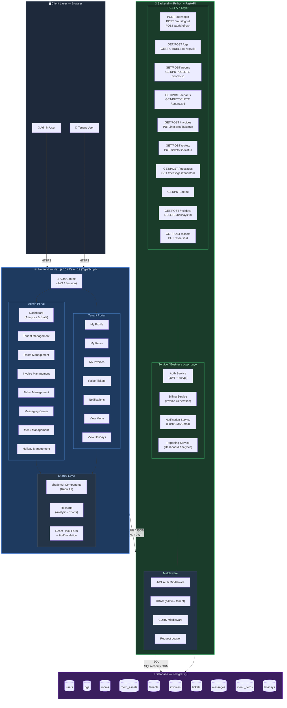
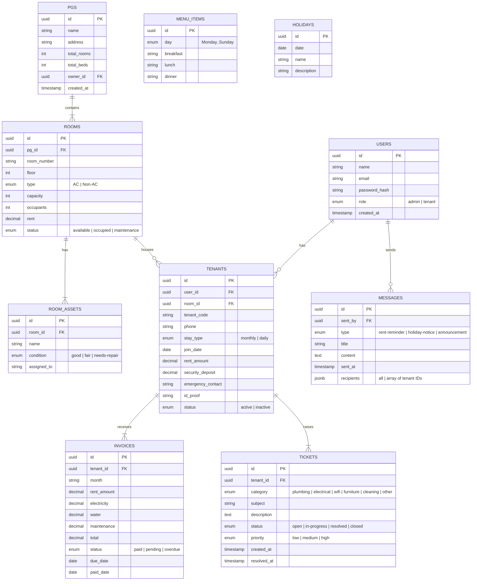
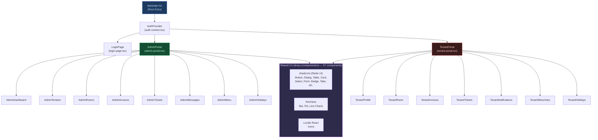
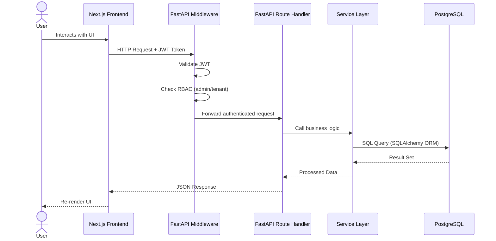

# PG Manager — System Architecture

> **Tech Stack**: Next.js 16 / React 19 (Frontend) · Python + FastAPI (Backend) · PostgreSQL (Database)

---

## 📐 High-Level System Architecture

---

## 🗄️ Database Entity Relationship Diagram

---

## ⚛️ Frontend Component Architecture

---

## 🔄 Request Data Flow

---

## 📦 Technology Stack Summary

| Layer | Technology | Purpose |
|---|---|---|
| **Frontend Framework** | Next.js 16 + React 19 | SSR/SSG, Routing, App Router |
| **Language (FE)** | TypeScript | Type safety |
| **Styling** | TailwindCSS v4 | Utility-first CSS |
| **UI Components** | shadcn/ui (Radix UI) | Accessible component library |
| **Charts** | Recharts | Dashboard analytics |
| **Forms** | React Hook Form + Zod | Form validation |
| **Icons** | Lucide React | Icon set |
| **Backend Framework** | Python + FastAPI | REST API, async support |
| **ORM** | SQLAlchemy | Database queries |
| **Auth** | JWT + bcrypt | Stateless authentication |
| **Database** | PostgreSQL | Relational data storage |
| **Migrations** | Alembic | DB schema versioning |
| **Deployment (FE)** | Vercel | CDN + Serverless hosting |
| **Deployment (BE)** | Render / AWS ECS | Container-based backend |

---

## 🏗️ Domain Modules

| Module | Admin Capabilities | Tenant Capabilities |
|---|---|---|
| **Auth** | Login, role-based access | Login, session management |
| **PG Management** | CRUD for PGs | View assigned PG info |
| **Room Management** | Manage rooms, assets | View room & assets |
| **Tenant Management** | Onboard, view, manage tenants | View own profile |
| **Invoices** | Generate, track billing | View & pay invoices |
| **Tickets** | Manage, resolve tickets | Raise & track tickets |
| **Messaging** | Broadcast announcements | Receive notifications |
| **Menu** | Update weekly meal plan | View meal schedule |
| **Holidays** | Add/remove holidays | View holiday calendar |
